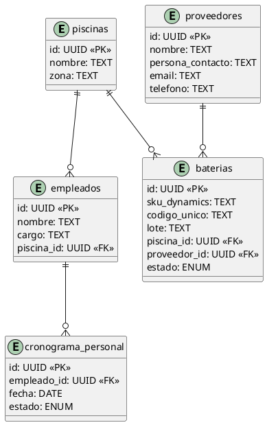

# 📊 Cómo Ver y Compartir los Diagramas

## Opción 1: Ver el Diagrama SVG Localmente

### En Windows
1. Abre el Explorador de Archivos
2. Navega a: `Desktop/2/DESARROLLO OMARSA/Gestion-Activos/`
3. Haz doble clic en `DATABASE_SCHEMA.svg`
4. Se abrirá en tu navegador predeterminado

### En el navegador
- Arrastra `DATABASE_SCHEMA.svg` a una pestaña de Chrome/Firefox
- Zoom con Ctrl+Plus/Minus
- Exporta como PNG: clic derecho → Guardar como PNG

---

## Opción 2: Plataformas Online (Recomendado)

### A. Lucidchart (Diagrama Profesional)
1. Ve a https://lucidchart.com
2. Regístrate gratis
3. Click en "Create Document"
4. Selecciona "Database Diagram"
5. Recrea el diagrama con las tablas:
   - **piscinas** → **baterias** (1:N)
   - **baterias** ← **proveedores** (1:N)
   - **baterias** → **comentarios_bateria** (1:N)
   - **baterias** → **paros_piscina** (1:N)
   - **empleados** → **cronograma_personal** (1:N)
   - **empleados** → **piscinas** (N:1)

6. Comparte el enlace con tu equipo

---

### B. Draw.io (Gratuito y Online)
1. Ve a https://draw.io
2. Clic en "Create New Diagram"
3. Selecciona "Database"
4. Importa nuestro SVG: File → Import From → File
5. Edita y personaliza:
   - Cambia colores
   - Agrega relaciones
   - Añade anotaciones
6. Descarga como PDF o comparte el enlace

**Ventaja:** Sin registrarse, completamente gratuito

---

### C. Miro (Para Colaboración en Equipo)
1. Ve a https://miro.com
2. Crea tablero gratis
3. Inserta imagen del diagrama
4. Agrega notas colaborativas
5. Invita a tu equipo
6. Haz brainstorming en tiempo real

---

### D. DbSchema (Especializado en BD)
1. Ve a https://dbschema.com
2. Opción "Online Editor" (gratis)
3. Nueva BD: Elige PostgreSQL
4. Importa nuestro schema SQL:
   ```
   File → Import → From SQL Script
   ```
5. Visualiza automáticamente las relaciones
6. Exporta como imagen o PDF

**Mejor para:** Ingenieros de BD

---

## Opción 3: Markdown + PlantUML

### Usar el diagrama en tu README.md

```markdown
## Diagrama de Base de Datos



### Visualizar en GitHub
- Sube el archivo `README.md` con el diagrama PlantUML
- GitHub lo renderiza automáticamente
- Otros usuarios ven el diagrama sin configuración

---

## Opción 4: Generar PDF Profesional

### Usando Python
```bash
# Instalar herramientas
pip install cairosvg pillow

# Convertir SVG a PDF
cairosvg DATABASE_SCHEMA.svg -o DATABASE_SCHEMA.pdf

# O convertir a PNG
cairosvg DATABASE_SCHEMA.svg -o DATABASE_SCHEMA.png
```

### Usando Online
1. Ve a https://cloudconvert.com
2. Sube `DATABASE_SCHEMA.svg`
3. Convierte a PDF o PNG
4. Descarga el resultado

---

## Opción 5: Publicar Documentación

### GitBook (Documentación + Diagramas)
1. Ve a https://gitbook.com
2. Crea un espacio de trabajo
3. Nueva página: "Base de Datos"
4. Inserta el diagrama SVG
5. Comparte con tu equipo
6. Todo versionado automáticamente

### Notion (Team Wiki)
1. Ve a https://notion.so
2. Crea página: "Arquitectura"
3. Sección: "Diagrama de BD"
4. Inserta imagen o incrusta SVG
5. Añade tabla con descripción de tablas
6. Comparte el workspace

---

## Comparativa de Plataformas

| Plataforma | Gratis | Profesional | Colaborativo | Fácil Uso |
|-----------|--------|-------------|--------------|-----------|
| Draw.io   | ✅     | ✅          | ✅           | ✅✅✅   |
| Lucidchart| ⚠️     | ✅✅✅      | ✅✅         | ✅✅     |
| Miro      | ⚠️     | ✅✅✅      | ✅✅✅       | ✅✅     |
| DbSchema  | ⚠️     | ✅✅✅      | ✅           | ✅        |
| GitBook   | ⚠️     | ✅✅✅      | ✅✅         | ✅✅     |
| GitHub+MD | ✅     | ✅          | ✅           | ✅        |

**Recomendación:** Draw.io para rapidez, Lucidchart para profesionalismo

---

## 📋 Documentación Incluida

En tu proyecto encontrarás:

```
Gestion-Activos/
├── DATABASE_DIAGRAM.md          # Diagrama en texto
├── DATABASE_SCHEMA.svg          # Diagrama SVG visual
├── MODULAR_ARCHITECTURE.md      # Arquitectura de 2 módulos
├── SUPABASE_SETUP.sql           # SQL para ejecutar
├── INSTALLATION_GUIDE.md        # Guía de instalación
└── VIEW_DIAGRAMS.md             # Este archivo
```

---

## 🎯 Pasos Rápidos (5 minutos)

1. **Opción rápida:** Abre `DATABASE_SCHEMA.svg` en tu navegador
2. **Opción compartir:** Sube a https://draw.io y comparte link
3. **Opción profesional:** Importa SQL a https://dbschema.com
4. **Opción equipo:** Crea tablero en https://miro.com con el diagrama

---

## ✅ Verificar el Diagrama

Asegúrate que veas:

### Tablas Principales
- [ ] piscinas (infraestructura)
- [ ] baterias (activos principales)
- [ ] proveedores (fuente de baterías)
- [ ] empleados (personal)
- [ ] cronograma_personal (turnos)
- [ ] paros_piscina (mantenimiento)
- [ ] comentarios_bateria (notas)

### Relaciones Correctas
- [ ] piscinas → baterias (1:N)
- [ ] proveedores → baterias (1:N)
- [ ] baterias → comentarios_bateria (1:N)
- [ ] baterias → paros_piscina (1:N)
- [ ] empleados → cronograma_personal (1:N)
- [ ] piscinas → empleados (1:N)

### Tipos de Datos
- [ ] UUIDs como claves primarias
- [ ] Foreign keys apuntando correctamente
- [ ] ENUM types: estado_bateria, estado_cronograma
- [ ] Timestamps en tablas de auditoría

---

**¡Diagrama listo para compartir! 🎉**
